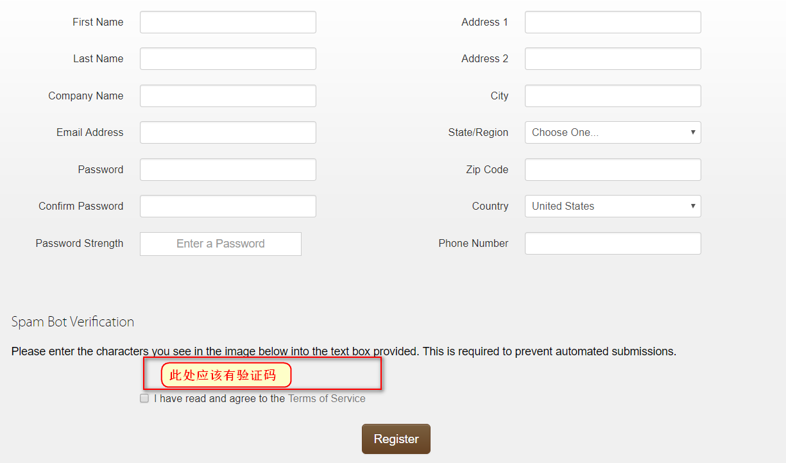
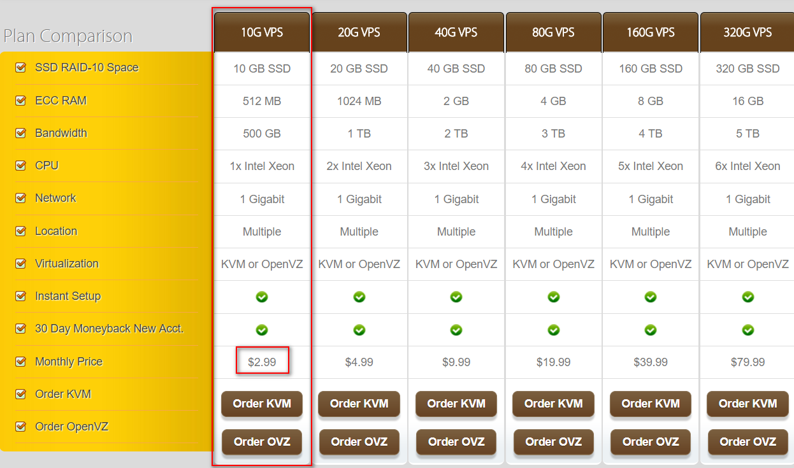
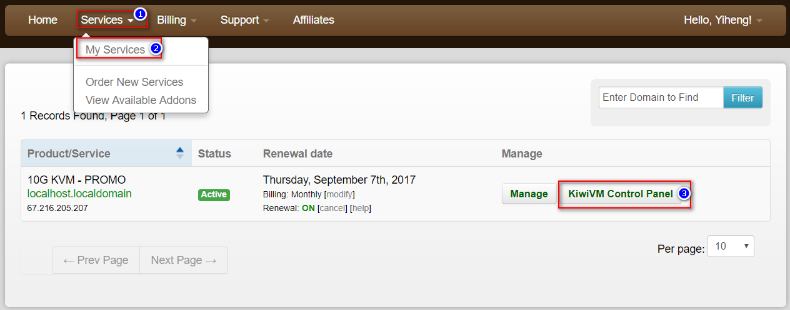
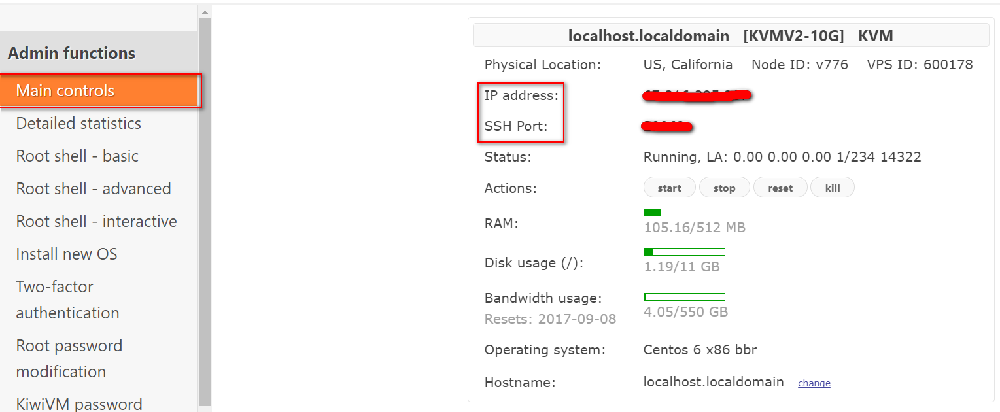
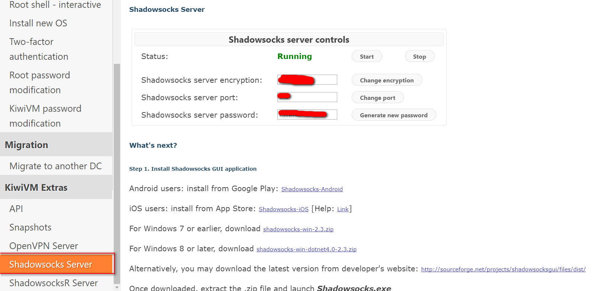

# 前言
作为一个经常上谷歌，YouTube的程序狗，不能自由的访问网络实在是让我很心烦，以前我都是买网上的vpn服务，但是由于不知名的原因，那个网站被封掉了...

购买vpn服务其实也有很多的弊端，例如数据有泄漏的隐患、网络高峰期速度会比较慢，还有就是vpn的费用比起整年购买的vps服务也是贵了不少。

前两天有一个哥们推荐了这么一个翻墙的神技，根据相应的关键字我百度了一番教程之后，终于被我摸索出一套可行的方案。下面是很详细的教程，希望新手们在走完教程后能享受到自由无限制的网络:)
<!--more-->
## 1.搬瓦工

### 1.1注册·
传送门：https://bwh1.net/register.php

需要提一句的是，在注册的时候，如果是国内的网络会显示不出验证码。

不过相信这种问题一定难不倒机智的你。

 

### 1.2 购买服务
作为个人用户，我推荐大家还是买第一个服务即可，不做为商业服务器部署项目的话，
每个月的500个G的流量是非常够用的。一年下来大概36美金。

 

### 1.3 服务管理
根据下图即可跳转到管理界面
 

主管理界面：
 
注意这里记录了你的ip地址和端口号，之后FS和SS的客户端会需要这些数据。

## 2. ShadowSocks
### 2.1 配置服务器端
SS服务器端的配置非常简单，因为搬瓦工已经帮我们一键集成了，
我们需要做的就是开启这个服务。具体流程参考下图。

 
在屏幕的左边点击Shadowsocks Server，第一次进入会提示你未开启该服务，
是否需要现在开启。直接点激活即可。

然后就会到上图的这个画面
